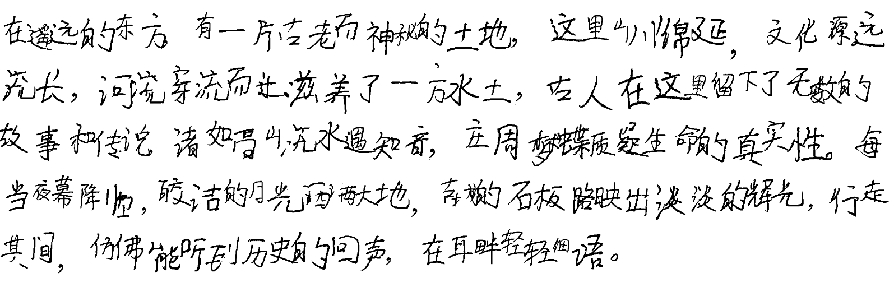

# handwriting
模仿真人手写字迹

源代码库：[Gsllchb/Handright: A lightweight Python library for simulating Chinese handwriting (github.com)](https://github.com/Gsllchb/Handright)

详细教程：[Handright/docs/tutorial.md at master · Gsllchb/Handright (github.com)](https://github.com/Gsllchb/Handright/blob/master/docs/tutorial.md)

安装：

```shell
pip install handright
```

代码示例：

```python
# coding: utf-8
from PIL import Image, ImageFont

from handright import Template, handwrite

text = """
在遥远的东方，有一片古老而神秘的土地，这里山川绵延，文化源远流长，河流穿流而过滋养了一方水土，古人在这里留下了无数的故事和传说，诸如高山流水遇知音，庄周梦蝶质疑生命的真实性。每当夜幕降临，皎洁的月光洒满大地，古城的石板路映出淡淡的辉光，行走其间，仿佛能听到历史的回声，在耳畔轻轻细语。
"""

template = Template(
    background=Image.new(mode="1", size=(2480,3508), color=1),
    font=ImageFont.truetype("Bo Le Locust Tree Handwriting Pen Chinese Font-Simplified Chinese Fonts.ttf", size=100),
    line_spacing=150,
    fill=0,  # 字体“颜色”
    left_margin=10,
    top_margin=10,
    right_margin=15,
    bottom_margin=10,
    word_spacing=-20,
    line_spacing_sigma=6,  # 行间距随机扰动
    font_size_sigma=13,  # 字体大小随机扰动
    word_spacing_sigma=3,  # 字间距随机扰动
    start_chars="“（[<",  # 特定字符提前换行，防止出现在行尾
    end_chars="，。",  # 防止特定字符因排版算法的自动换行而出现在行首
    perturb_x_sigma=6,  # 笔画横向偏移随机扰动
    perturb_y_sigma=7,  # 笔画纵向偏移随机扰动
    perturb_theta_sigma=0.05,  # 笔画旋转偏移随机扰动
)
images = handwrite(text, template)
for i, im in enumerate(images):
    assert isinstance(im, Image.Image)
    im.show()
    im.save("./{}.webp".format(i))
```

效果:



> 本人字丑，上面已经达到我需要的效果了。想要更好看，请按照[教程](https://github.com/Gsllchb/Handright/blob/master/docs/tutorial.md)自行更改参数
